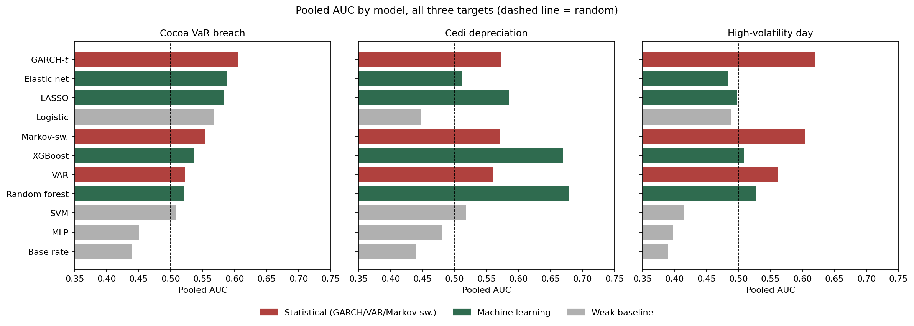
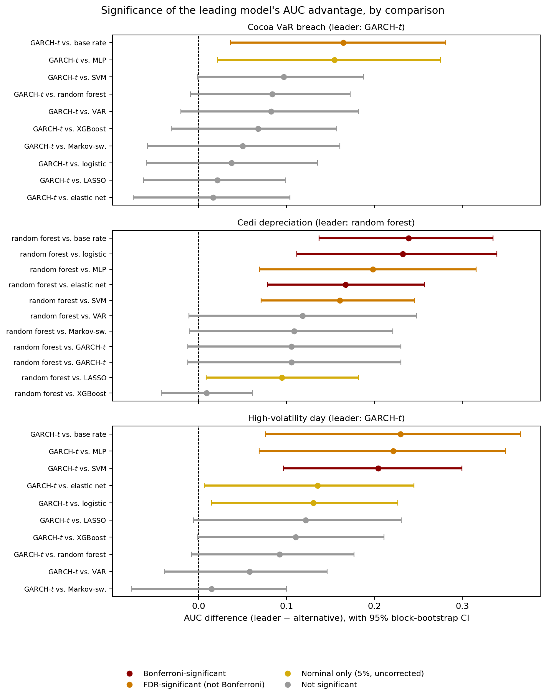

# Robust Machine Learning versus Statistical Models for Commodity and Macroeconomic Risk Signals

Does machine learning actually beat classical econometrics for financial risk prediction, or does it just look that way because most comparisons never check if the "winning" model's edge is real or just noise? That's the question this project is built around, using Ghana's cocoa, gold, oil and cedi exposure as the test case.

Full manuscript: [`paper/paper.tex`](paper/paper.tex) ([PDF](paper/paper.pdf)), aimed at the *Journal of Risk and Financial Management*. Sister project: [tail-dependence-ghana](https://github.com/Jonathanerrils/tail-dependence-ghana), which looks at how the same commodities co-move in the tails rather than how well they can be predicted.

## What we found

Eleven models go head to head: four statistical (a base rate, GARCH-*t*, a vector autoregression, and a two-state Markov-switching model) against seven machine-learning classifiers (logistic, LASSO, elastic net, random forest, XGBoost, SVM, and a small neural net kept deliberately weak). Three daily risk signals for Ghana — cocoa VaR breaches, cedi depreciation episodes, high-volatility days — tested with nested time-series cross-validation on nine years of real data (2015–2026), with the actual 2024 cocoa supply shock held out as a genuine stress test rather than something simulated.

The short version: **every serious model clearly beats a naive baseline, but once you correct for the 31 comparisons this study actually runs, nothing beats anything else** for cocoa risk or high-volatility days. Random forest does hold up against the weakest models for cedi depreciation — that one result survives even the strictest correction — but not against the other serious contenders like XGBoost, GARCH, VAR, or Markov-switching.

| | |
|---|---|
|  |  |

We read this as a finding about model risk, not a verdict on which paradigm wins — the same conclusion the companion tail-dependence project reached from a completely different angle. A recent, almost identically designed study on the CAD/USD exchange rate landed in the same place, which is reassuring: it suggests this isn't just something specific to Ghana's data, but a real property of the comparison itself.

## Repository structure

```
paper/                  Full manuscript (paper.tex, paper.pdf, 4 figures, bib)
src/riskml/
  features.py            Leakage-free feature engineering, rolling labels
  models.py               11-model zoo (statistical + ML), incl. VAR and
                          Markov-switching exceedance-probability models
  validation.py            Expanding-window fold construction
  nested_cv.py             Nested time-series CV with tuning-fallback logic
  significance.py          Paired block-bootstrap AUC-difference testing
  interpret.py             Permutation importance, SHAP, PDP, stability
scripts/
  02_nested_cv_full.py     Full nested-CV run, all models, all targets
  03_interpretability_final.py   Interpretability on the final tuned models
  04-06_build_fig*.py       Figure generation
outputs/tables/          Nested-CV results, significance tests, importances
outputs/figures/          The 4 figures used in the paper
data/raw/bog/, data/raw/fred/   Redistributable official source data
DECISIONS.md              Full build log: every bug found and fixed, every
                          methodological choice, with reasoning
```

## Quickstart

```bash
python -m venv .venv && source .venv/bin/activate
pip install -r requirements.txt

# Real data (requires internet; commodity futures are fetch-only, not
# redistributed here — see the companion repo's 01_fetch_real_data.py
# and 04_integrate_bog.py to build the canonical panel first)
python scripts/02_nested_cv_full.py        # ~12 minutes
python scripts/03_interpretability_final.py # ~10 minutes
python scripts/04_build_fig1_auc.py
python scripts/05_build_fig2_significance.py
python scripts/06_build_fig3_stability.py

# Compile the paper
cd paper && pdflatex paper.tex && bibtex paper && pdflatex paper.tex && pdflatex paper.tex
```

## Where the data comes from, and what we can and can't share

Commodity futures come from the companion project's cleaned panel — Yahoo's terms don't let us redistribute that, so it's fetch-only. The cedi series is the Bank of Ghana's own interbank rate (full story on that in the companion repo). The policy rate is official BoG data and it's committed here under `data/raw/bog/` — though fair warning, it had the exact same gotcha as the exports data in the companion project: a reporting gap encoded as a literal `0.00` instead of just being left blank. Caught it, fixed it the same way as before. VIX and the Fed's broad dollar index come from FRED and live under `data/raw/fred/`.

## Honest gaps

Seven citations still have missing author names: the two Ghana-specific
exchange-rate papers (LSTM and XGBoost), the Ghana BMA paper, the
LSTM-attention currency-crisis paper, the regime-count paper, the
currency-crisis EWS paper, and the structural-breaks JRFM paper. A
literature-verification pass (see `DECISIONS.md`) fixed the four that
mattered most — including the CAD/USD paper, our single most important
citation, which had no author at all until we tracked down the actual
nine names on arXiv — and flagged these seven as still needing a
primary-source lookup before formal submission. We're leaving them
exactly as flagged rather than guessing at names to make the warnings
go away.

We also looked seriously at adding an LSTM or GRU and decided against
it — not because it's a bad idea, but because the sample size genuinely
can't support it (the paper's Limitations section walks through the
math). And the hyperparameter grids are modest, a handful of values
each, not an exhaustive sweep — kept deliberately small so the nested CV
finishes in a reasonable time.

## License

MIT — see `LICENSE`.
